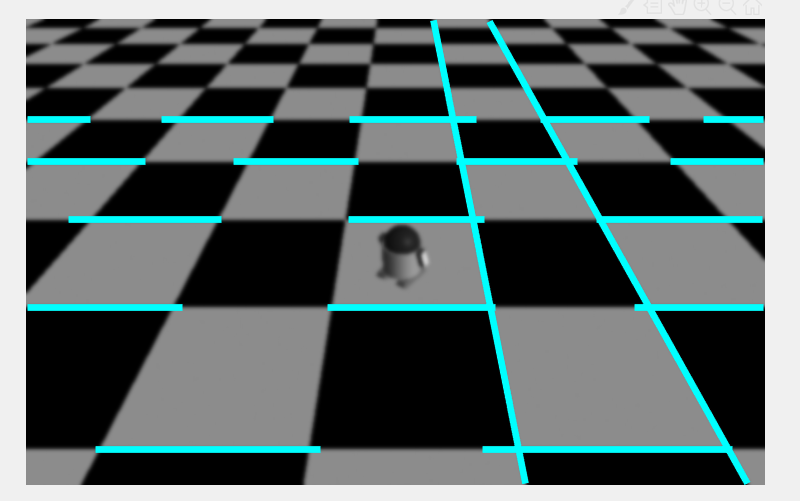

 
 
# 数字图像处理课程作业实验七

**张程博昊**

**自动化64**

**2160504106**

**2019年5月16日**

## 摘要
此次实验主要对图像使用Sobel、canny等算子进行边缘检测，并在边缘检测的基础上进行Hough变换，以此达到直线检测的目的。并通过对比，比较不同算子优缺点以及不同参数对直线检测所产生的影响的大小。实验环境为matlab 2018.

## 实验内容

### 1. 首先对测试图像（文件名为：test1~test6）进行边缘检测，可采用书上介绍的Sobel等模板或者cann算子方法；

在MATLAB中借用edge（）函数，得出以下结果，左侧为原图像，中间为sobel算子，右侧为canny算子：

test1：

test2：

test3：

test4：

test5：

test6：

### 2. 在边缘检测的基础上，用hough变换检测图中直线；

Hough变换是一种使用表决原理的参数估计技术。其原理是利用图像空间和Hough参数空间的点－线对偶性，把图像空间中的检测问题转换到参数空间。
先进行边缘检测，之后利用其进行Hough变换。利用Hough系列函数，得出以下结果：

test1：

test2：

test3：

test4：

test5：

test6：

### 3. 比较不同边缘检测算法（2种以上）、不同hough变换参数对直线检测的影响；

#### (1)不同边缘检测算法对直线检测的影响

canny：

sobel：

**结论：**

1.从实验的处理结果来看，Canny算子对边缘的检测能力要优于Sobel算子，它对图像细节的提取更加精确。

2.Sobel算子对一些较为复杂的图像处理则非常粗糙。 

3.canny运算速度慢于Sobel算子，处理较慢。

4.一些特定图像sobel效果较好。

#### (2)不同hough变换参数对直线检测的影响

##### Hough峰值变化：

峰值为7：

峰值为5：

**结论：可以发现随着峰值的变换检测出的直线的数量也随之变化。**

#### Hough角度变化：

角度间隔为0.2：

角度间隔为2：

**结论：可以发现随着角度的变换检测出的直线的角度也随之变化。**

## 附录

代码见文件

## 参考文献

[1] 冈萨雷斯, 数字图像处理（第三版）, 电子工业出版社

